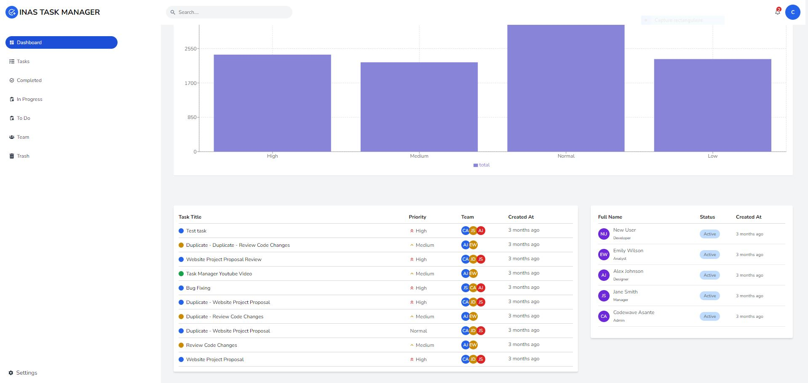
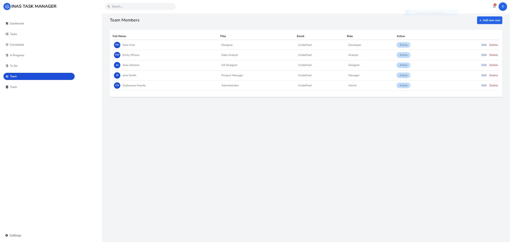
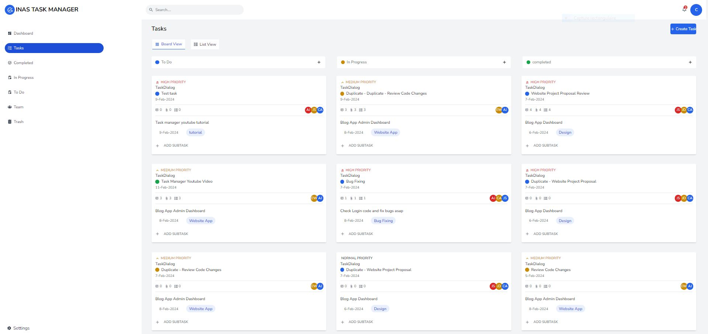
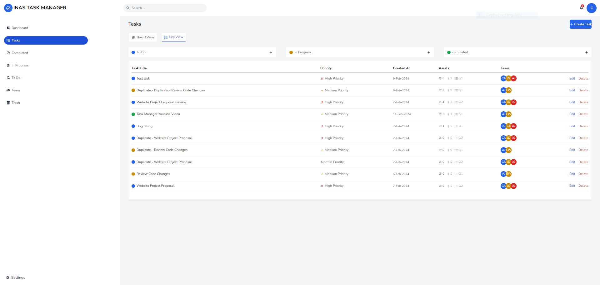
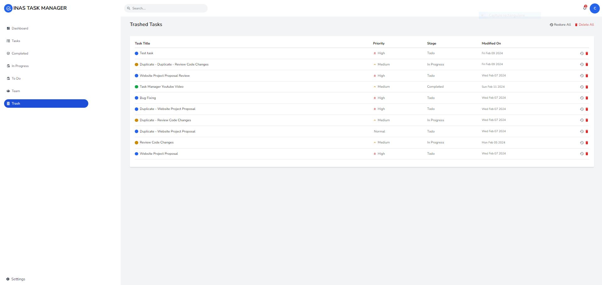

# Task Manager

Your go-to task manager for seamless organization and enhanced productivity. With intuitive design, customizable tags, and timely reminders, TaskMaster helps you conquer your to-do list effortlessly. Stay focused, track progress, and never miss a deadline again. Download now and master your tasks with ease.

## Introduction

Our project task manager, TaskMaster, is designed to streamline project organization and boost productivity. Its purpose is to help users efficiently manage tasks, deadlines, and priorities to ensure project success. 

Key functionalities include:
1. Task creation and assignment: Users can easily create tasks and assign them to team members.
2. Deadline tracking: TaskMaster provides clear visibility of project deadlines, ensuring timely completion.
3. Priority management: Users can prioritize tasks based on importance, keeping the team focused on critical objectives.
4. Collaboration features: TaskMaster facilitates communication and collaboration among team members, fostering synergy and coordination.
5. Progress monitoring: Users can track task progress and project milestones to stay on top of project developments.
6. Reporting and analytics: TaskMaster offers insights into project performance, enabling users to identify areas for improvement and optimize workflow.
   
### Authors:

Achref Bennadji -> [Facebook](https://www.facebook.com/profile.php?id=100009395125800&locale=fr_FR)

## Getting Started

To get started with the project, follow these steps:

1. **Clone the repository:**
   ```bash
   git clone "https://github.com/devachref/LandingPage.git"
   ```

2. **Install dependencies:**
   ```bash
   cd finalproject
   npm install
   ```

3. **Start the client development server from root:**
   ```bash
   npm run client
   ```

3. **Start the server development server from root:**
   ```bash
   npm run server
   ```

4. **Open the application:**
   - Open your browser and navigate to http://localhost:3000


## Related Projects

- **Notion:**
- **ticktick**
- **todolist**


## Key Features

- **Dashboard**:
  - Stay on top of task activities with the ability to add comments
    
- **User Management**:
  - Effortlessly create and manage team accounts, control access, and permissions.
    
- **Task Assignment**:
  - Assign tasks to individual or multiple users, update task details, and track status.
    
- **Task Properties**:
  - Label tasks, assign priority levels, manage sub-tasks, and upload task assets.
    
- **Trash**:
  - Easily recover deleted tasks or items from the Trash.
    
    
## Technologies Used

- **Framework:** NestJs & Next.js
- **Programming Language:** TypeScript
- **Styling:** Tailwind CSS
- **User Management:** Clerk
- **ORM:** Prisma
- **UI Components:** shadcn/ui
- **File Uploads:** uploadthing
- **Typesafe APIs:** RestAPI
- **Form Handling:** React Hook Form
- **Data Validation:** Zod
- **Code Quality:** ESLint, Prettier, Husky
- **Testing:** Jest, Cypress
- **CI/CD:** GitHub Actions
- **Hosting:** Vercel

